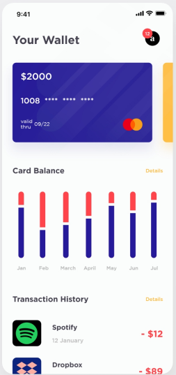
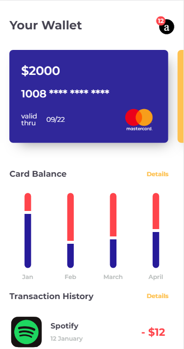

# Wallet app mockup

Based on a [design by 4wd](https://www.uplabs.com/posts/wallets-app-4f300e52-de23-4593-984f-dc3abcbd882a), I created a user interface mockup using basic HTML and CSS grids.

I made this project to practice CSS grids.

You can compare both versions (original design / implementation):

